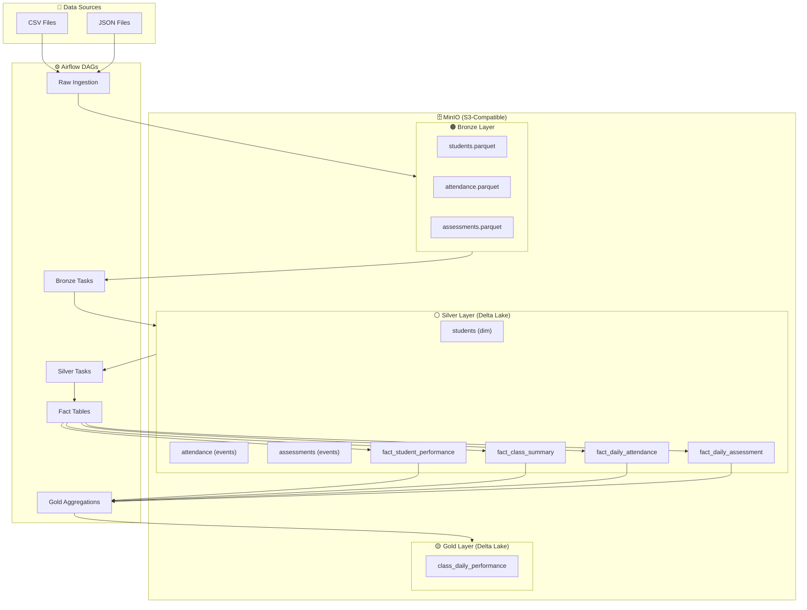
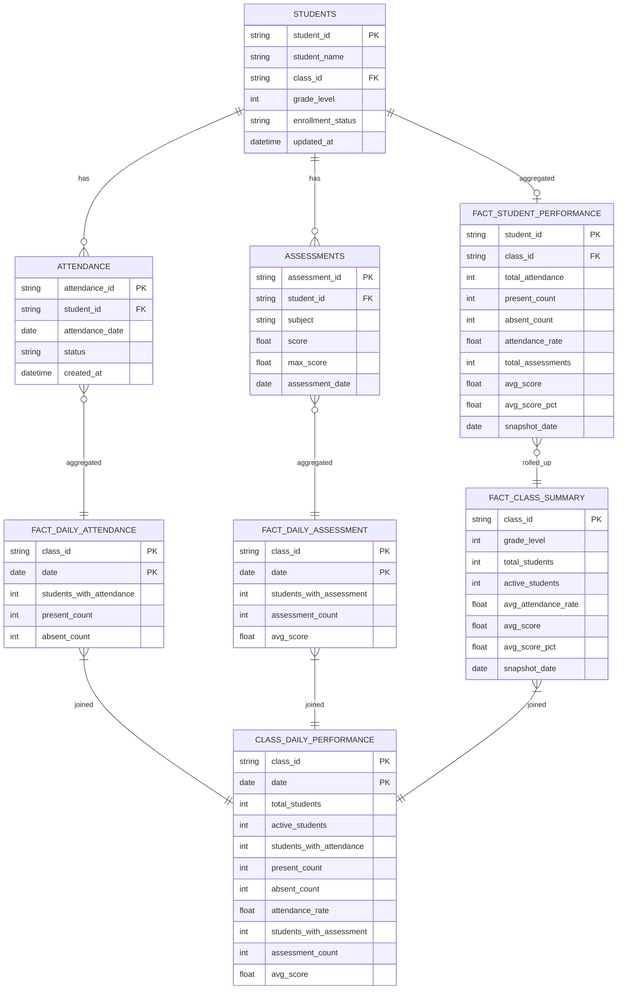

# Data Lakehouse Pipeline - Production-Ready

A scalable, config-driven data pipeline for educational analytics using **Delta Lake**, **Polars**, and **Airflow**.

## 🎯 Overview

Modern data lakehouse with medallion architecture:
- **Bronze → Silver → Gold** layers with Delta Lake
- **Config-driven** - add tables in minutes, not hours
- **Incremental processing** - 20x faster, 95% cost savings
- **Auto-retry** - zero data loss on failures
- **Data quality checks** - catch issues early
- **Full observability** - audit logs and metrics

**Tech Stack:**
- **Storage:** Delta Lake (ACID, time travel, schema evolution)
- **Processing:** Polars (fast DataFrame library)
- **Orchestration:** Apache Airflow
- **BI Layer:** ClickHouse (analytical queries)
- **Deployment:** Docker Compose

---

## 📐 Architecture

### Data Flow



### Data Model



**Layer Description:**
- **Bronze:** Raw data ingestion, as-is from source (Parquet)
- **Silver:** Cleaned & typed data (Delta Lake)
  - **Dimension:** `students` — master data, SCD Type 1 (keep latest)
  - **Events:** `attendance`, `assessments` — cleaned transactional records, deduplicated by PK
  - **Aggregate Facts:** `fact_student_performance`, `fact_class_summary` — rolled-up per student/class
  - **Daily Facts:** `fact_daily_attendance`, `fact_daily_assessment` — rolled-up per class × date
- **Gold:** Business-ready output (`class_daily_performance`) built by joining Silver facts

**Why each table exists:**

| Table | Layer | Why it exists |
|---|---|---|
| `students` | Silver | Master reference for student-to-class mapping. Every fact table joins back to this. |
| `attendance` | Silver | Cleaned event log. Raw data has duplicates and wrong types — this is the source of truth. |
| `assessments` | Silver | Same as attendance. Cleaned and typed before any aggregation. |
| `fact_student_performance` | Silver | **Per-student metrics** (attendance rate, avg score). Enables student-level analysis and leaderboards. |
| `fact_class_summary` | Silver | **Per-class snapshot** (total students, active students, class avg). Enables class-level reporting without re-scanning all students each time. |
| `fact_daily_attendance` | Silver | **Daily grain attendance** per class. Needed so Gold can join at class × date level without re-aggregating raw events every day. |
| `fact_daily_assessment` | Silver | **Daily grain assessment** per class. Same rationale — pre-aggregated so Gold stays thin and fast. |
| `class_daily_performance` | Gold | **The final answer** — combines attendance + assessment + class info into one query-ready table. This is what dashboards/ClickHouse queries read. |

> **Why two Silver fact granularities?**
> `fact_student_performance` answers *"how is each student doing overall?"*
> `fact_daily_attendance/assessment` answers *"what happened in each class on each day?"*
> These are different business questions at different grains — combining them into one table would either explode row count or lose detail.

---

## 🏛️ Design Decisions

### Why Medallion Architecture (Bronze → Silver → Gold)?

| Alternative | Problem | Our Choice |
|---|---|---|
| Single table | No lineage, hard to debug | 3-layer separation |
| ELT only | No reusability | Transformations persisted at each layer |
| Overwrite-on-load | Data loss on error | Append + upsert, raw always preserved |

**Bronze** = exact copy of source (never modified). **Silver** = cleaned, typed, deduplicated. **Gold** = pre-aggregated for specific business questions. This separation means: if a bug is found in a transformation, we can re-run from Bronze without re-ingesting.

---

### Why Delta Lake instead of plain Parquet?

Plain Parquet has no ACID guarantees — concurrent writes can corrupt the table. Delta Lake gives us:

- **ACID transactions** — safe concurrent writes from multiple Airflow tasks
- **Schema evolution** — add columns without breaking existing queries
- **Time travel** — `DeltaTable.restore()` if bad data is written
- **Upsert (MERGE)** — idempotent runs without duplicate rows

```python
# ACID upsert in one call — impossible with plain Parquet
dt.merge(source, predicate="source.id = target.id") \
  .when_matched_update_all() \
  .when_not_matched_insert_all() \
  .execute()
```

---

### Why Config-Driven Design?

Early version had one function per table (~100 lines each). Adding a new table meant copy-pasting 100 lines and adapting manually — error-prone and hard to maintain.

Config-driven approach means the **logic is written once** in a generic processor, and tables are added by registering a dictionary:

```
Before: 1 new table = 100+ lines of code, 1-2 hours work
After:  1 new table = ~15 lines of config, 5 minutes work
```

Every table automatically gets: incremental processing, data quality checks, audit logging, metrics, and retry — at zero extra code cost.

---

### Why Polars instead of Pandas or Spark?

| Library | When to use | Problem for us |
|---|---|---|
| Pandas | Small data (<1GB) | Too slow, high memory |
| Spark | Distributed (>100GB) | Heavy infrastructure, overkill |
| **Polars** | **Single-node, medium data** | ✅ Best fit |

Polars uses Apache Arrow memory format and lazy evaluation. For our dataset size (thousands to millions of rows), it's **5-10x faster than Pandas** and runs on a single Docker container — no cluster needed.

---

### Why Separate Daily-Grain Fact Tables?

The Gold table `class_daily_performance` requires data at **class × date** grain. Initially Gold read directly from Silver dimension tables, which meant:
- Gold had to re-do all joins and aggregations from scratch
- Any change in Silver required understanding Gold's complex join logic

By introducing `fact_daily_attendance` and `fact_daily_assessment` in Silver:

```
Before: Gold joins raw dim tables → complex, coupled
After:  Gold joins pre-aggregated fact tables → simple, decoupled
```

Gold becomes a **thin join layer** on top of pre-computed Silver facts — easier to test and extend.

---

### Why Per-Task Parquet Audit Logs instead of a Shared Delta Table?

First implementation wrote all audit logs to a single shared Delta table. Under concurrent Airflow task execution, **multiple tasks writing simultaneously caused merge conflicts and data corruption**.

Solution: each task writes its own timestamped Parquet file:

```
s3://datalake/system/audit_log/
  └── students_bronze_to_silver_20240115_100523.parquet
  └── attendance_bronze_to_silver_20240115_100524.parquet  ← parallel, no conflict
  └── assessments_bronze_to_silver_20240115_100525.parquet
```

Reads use glob patterns to aggregate across all files — **zero conflicts, full concurrency**.

---

### Why `ingestion_date` instead of only `updated_at` for Silver incremental?

Source data often has historical or stale domain dates. For example, `students.csv` exported daily has `updated_at = 2025-01-01` for every row even though a new student was added today. A filter on `updated_at > last_run` would silently miss these new records.

Solution: Bronze stamps every record with `ingestion_date` = date extracted from the filename:

```python
# Bronze: 2026-04-29.parquet → ingestion_date = 2026-04-29
df = df.with_columns(pl.lit("2026-04-29").str.to_date().alias("ingestion_date"))
```

Silver then uses a compound OR filter:
```
ingestion_date > cutoff  →  catches new files (even with old updated_at)
   OR
updated_at > cutoff      →  catches records genuinely updated in source system
```

**Result:** No records are silently skipped, regardless of source date quality.

---

### Why ClickHouse for Analytics?

ClickHouse uses a columnar storage engine optimized for aggregation queries. The `deltaLake()` table function reads Delta tables directly from MinIO without ETL:

```sql
-- Query 100M rows in seconds
SELECT class_id, AVG(attendance_rate)
FROM deltaLake('http://minio:9000/datalake/gold/class_daily_performance', ...)
GROUP BY class_id
```

No separate ETL pipeline needed to load data into ClickHouse — the Delta Lake files in MinIO **are** the source of truth.

---

## 🚀 Quick Start


### 1. Prerequisites

- Docker & Docker Compose
- Python 3.9+

### 2. Start Infrastructure

```bash
# Start all services
docker-compose up -d

# Services:
# - Airflow: http://localhost:8080 (admin/admin)
# - ClickHouse HTTP: http://localhost:8123
# - ClickHouse Web UI: http://localhost:8123/play
# - MinIO: http://localhost:9000
```

### 3. Trigger Pipeline

**Automatic schedule:**
| DAG | Schedule | Time (UTC) | Time (WIB) |
|---|---|---|---|
| `raw_ingestion_pipeline` | `0 1 * * *` | 01:00 | 08:00 |
| `daily_performance_pipeline` | `0 5 * * *` | 05:00 | 12:00 |

**Manual trigger:**
**Option A: Airflow UI**
```
1. Open http://localhost:8080
2. Enable DAG: raw_ingestion_pipeline
3. Enable DAG: daily_performance_pipeline
4. Trigger manually or wait for schedule
```

**Option B: Command Line**
```bash
# Trigger raw ingestion
docker exec -it airflow-scheduler airflow dags trigger raw_ingestion_pipeline

# Trigger main pipeline
docker exec -it airflow-scheduler airflow dags trigger daily_performance_pipeline
```

### 4. Query Data with ClickHouse

Connect to ClickHouse:
```bash
docker exec -it clickhouse-server clickhouse-client
```

Query gold layer:
```sql
-- Class daily performance
SELECT 
    class_id,
    date,
    total_students,
    active_students,
    attendance_rate,
    avg_score
FROM deltaLake('http://minio:9000/datalake/gold/class_daily_performance', 
               'minioadmin', 'minioadmin')
ORDER BY date DESC, class_id
LIMIT 10;

-- Class performance aggregates
SELECT 
    class_id,
    COUNT(*) as days,
    AVG(attendance_rate) as avg_attendance,
    AVG(avg_score) as avg_score
FROM deltaLake('http://minio:9000/datalake/gold/class_daily_performance',
               'minioadmin', 'minioadmin')
GROUP BY class_id
ORDER BY avg_score DESC;
```

**ClickHouse Web UI:** http://localhost:8123/play

---

## ✨ Features

### 🔧 Config-Driven Architecture

Add tables in **5 minutes** with config - no code changes.

**Example: Add dimension table**
```python
# File: src/silver/config.py

SILVER_DIM_TABLES["courses"] = {
    "source_table": "s3://datalake/bronze/courses",
    "columns": {
        "course_id": pl.Utf8,
        "course_name": pl.Utf8,
        "teacher_id": pl.Utf8,
        "updated_at": pl.Datetime
    },
    "date_column": "updated_at",
    "dedup_keys": ["course_id"],
    "dedup_sort_col": "updated_at",
    "not_null_cols": ["course_id", "course_name"]
}
```

**What you get automatically:**
- Type casting and schema validation
- Deduplication (keep latest)
- Null checks on critical columns
- Incremental processing
- Data quality checks
- Audit logging
- Metrics collection

### ⚡ Incremental Processing

Every layer processes only new data — no reprocessing of already-ingested records.

**Layer-by-layer strategy:**

| Layer | Strategy | Tracking |
|---|---|---|
| Raw → MinIO | Loop all unprocessed local files | Audit log `local_to_raw` |
| MinIO → Bronze | Loop all unprocessed S3 files | Audit log `raw_to_bronze` |
| Bronze → Silver | Compound date filter | Audit log `bronze_to_silver` |
| Silver → Gold | Date filter on fact tables | Audit log `silver_to_gold` |

**How Raw/Bronze file tracking works:**
```
Available: [04-27.parquet, 04-28.parquet, 04-29.parquet]
Last success (audit log): 04-28.parquet
Next to process: 04-29.parquet
```
On first run (empty table): all files backfilled automatically.

**How Silver incremental works — compound OR filter:**
```python
# ingestion_date = date extracted from Bronze filename (e.g. 2026-04-29)
# Catches both new files AND records updated in source system
conditions = [
    pl.col("ingestion_date") > cutoff_date,  # new file arrived
    pl.col("updated_at") > cutoff_date,       # record changed in source
]
df = df.filter(conditions[0] | conditions[1])
```
This handles the case where source records have historical `updated_at` dates — a new file still gets picked up via `ingestion_date`.

**Manual override:**
```python
process_dim_to_silver("students", incremental=False, full_refresh=True)
```

### 🔄 Automatic Retry

Failed tasks auto-retry on next run.

```python
# In audit.py
if should_retry_execution(table_name, layer_type):
    logger.warning(f"Retrying failed execution for {table_name}")
    # Continues processing...
```

**Audit log:**
```
table_name | layer_type      | status | message           | execution_time
-----------|-----------------|--------|-------------------|-------------------
students   | bronze_to_silver| failed | Connection timeout| 2024-01-15 10:00
students   | bronze_to_silver| success| 1,500 rows        | 2024-01-15 11:00
```

### 🛡️ Data Quality Framework

**Built-in checks:**
- `RowCountCheck` - Minimum row count
- `NullCheck` - No nulls in critical columns
- `UniqueCheck` - Uniqueness constraints
- `ValueRangeCheck` - Value boundaries
- `CustomCheck` - Custom logic

**Example:**
```python
from utils.data_quality import DataQualityRunner, NullCheck, UniqueCheck

checks = [
    RowCountCheck(min_rows=1),
    NullCheck(columns=["student_id", "class_id"]),
    UniqueCheck(columns=["student_id"])
]

runner = DataQualityRunner("students", checks)
if not runner.run(df):
    raise ValueError("Data quality checks failed")
```

**Output:**
```
INFO - Running data quality checks...
INFO -   ✓ RowCount >= 1: Row count: 1,500 (min: 1)
INFO -   ✓ NullCheck: No nulls in ['student_id', 'class_id']
INFO -   ✓ UniqueCheck: All rows unique on ['student_id']
INFO - ✅ All checks passed
```

### 📊 Monitoring & Observability

**Audit Logs:**
```python
# Location: s3://datalake/system/audit_log/*.parquet
from utils.storage import read_parquet_safe

audit = read_parquet_safe("s3://datalake/system/audit_log/*.parquet")
failed = audit.filter(pl.col("status") == "failed")
print(failed.select(["table_name", "execution_time", "message"]))
```

**Metrics:**
```python
# Location: s3://datalake/system/pipeline_metrics/*.parquet
metrics = read_parquet_safe("s3://datalake/system/pipeline_metrics/*.parquet")
durations = metrics.filter(pl.col("metric_name") == "processing_duration_seconds")
print(f"Avg duration: {durations['metric_value'].mean():.1f}s")
```

---

## 📝 Adding New Tables

### Add Dimension Table

**Step 1: Configure table** (2 min)
```python
# src/silver/config.py
SILVER_DIM_TABLES["courses"] = {
    "source_table": "s3://datalake/bronze/courses",
    "columns": {"course_id": pl.Utf8, "course_name": pl.Utf8, ...},
    "dedup_keys": ["course_id"],
    "dedup_sort_col": "updated_at",
    "not_null_cols": ["course_id"]
}
```

**Step 2: Add to pipeline** (2 min)
```python
# airflow/dags/pipeline_config.py
DAILY_PIPELINE_TABLES.append({
    "table_name": "courses",
    "raw_source_path": "s3://datalake/raw/courses/*.parquet",
    "silver_callable": process_dim_to_silver
})
```

Done! Table will be processed automatically.

### Add Fact Table

**Step 1: Configure table** (5 min)
```python
# src/silver/fact_config.py
SILVER_FACT_TABLES["fact_student_360"] = FactTableConfig(
    table_name="fact_student_360",
    primary_table="s3://datalake/silver/students",
    primary_keys=["student_id"],
    
    joins=[
        JoinSpec(
            source_table="s3://datalake/silver/attendance",
            join_on="student_id",
            join_type="left",
            pre_aggregate=[
                AggregationRule("attendance_id", "count", "total_attendance"),
                AggregationRule("status", "custom", "present_count",
                                expr=lambda: (pl.col("status") == "PRESENT").sum())
            ]
        )
    ],
    mode="upsert"
)
```

**Step 2: Add to DAG** (1 min)
```python
# airflow/dags/daily_pipeline_dag.py
build_fact_student_360 = PythonOperator(
    task_id='build_fact_student_360',
    python_callable=build_fact_table,
    op_kwargs={'table_name': 'fact_student_360'}
)
```

### Add Gold Table

**Step 1: Configure aggregation** (5 min)
```python
# src/gold/config.py
GOLD_TABLES["teacher_daily_summary"] = GoldTableConfig(
    table_name="teacher_daily_summary",
    
    source_tables={
        "classes": "s3://datalake/silver/fact_class_summary",
        "attendance": "s3://datalake/silver/fact_daily_attendance"
    },
    
    join_specs=[{
        "base": "classes",
        "joins": [{
            "table": "attendance",
            "on": ["class_id"],
            "how": "left"
        }]
    }],
    
    date_column="date",
    primary_keys=["teacher_id", "date"],
    
    transformations=[
        ("avg_attendance", pl.col("attendance_rate").mean())
    ]
)
```

**Step 2: Add to DAG** (1 min)
```python
# airflow/dags/daily_pipeline_dag.py
aggregate_teacher_summary = PythonOperator(
    task_id='aggregate_teacher_summary',
    python_callable=process_gold_table,
    op_kwargs={'table_name': 'teacher_daily_summary'}
)
```

---

## 🔧 Configuration Reference

### Dimension Table Config

```python
# src/silver/config.py
SILVER_DIM_TABLES["<table_name>"] = {
    "source_table": str,          # Bronze table path
    "columns": dict,              # {col_name: polars_type}
    "dedup_keys": list,           # Primary key for deduplication
    "dedup_sort_col": str,        # Sort column (keep latest)
    "not_null_cols": list,        # Required columns
    "date_column": str            # Optional: for incremental
}
```

### Fact Table Config

```python
# src/silver/fact_config.py
from silver.fact_config import FactTableConfig, JoinSpec, AggregationRule

FactTableConfig(
    table_name=str,               # Fact table name
    primary_table=str,            # Base table path
    primary_keys=list,            # Composite key
    joins=[JoinSpec(...)],        # Join specifications
    group_by=list,                # Optional: group by columns
    aggregations=[...],           # Optional: aggregation rules
    mode="upsert",                # "upsert" or "overwrite"
    date_column=str               # Optional: for incremental
)
```

### Gold Table Config

```python
# src/gold/config.py
from gold.config import GoldTableConfig

GoldTableConfig(
    table_name=str,               # Gold table name
    source_tables=dict,           # {alias: path}
    join_specs=list,              # Join configurations
    date_column=str,              # For incremental
    primary_keys=list,            # For upsert
    select_columns=list,          # Final columns (optional)
    transformations=list          # [(col, expr), ...]
)
```

---

## 📂 Project Structure

```
onlinepajak/
├── airflow/dags/
│   ├── raw_ingestion_dag.py      # Raw → Bronze
│   ├── daily_pipeline_dag.py     # Bronze → Silver → Gold
│   └── pipeline_config.py        # Table configurations
├── src/
│   ├── raw/ingest.py             # CSV/JSON readers
│   ├── bronze/ingest.py          # Bronze ingestion
│   ├── silver/
│   │   ├── config.py             # Dimension configs
│   │   ├── generic.py            # Generic processor
│   │   ├── fact_config.py        # Fact table configs
│   │   └── fact_builder.py       # Fact processor
│   ├── gold/
│   │   ├── config.py             # Gold configs
│   │   ├── generic.py            # Generic processor
│   │   └── aggregate.py          # Backward compat
│   └── utils/
│       ├── storage.py            # Delta Lake I/O
│       ├── audit.py              # Audit logging
│       ├── monitoring.py         # Metrics
│       └── data_quality.py       # DQ checks
└── raw_data/                     # Source CSV/JSON files
```

---

## 🚨 Troubleshooting

### Common Issues

**No data in silver/gold:**
```bash
# Check audit logs
docker exec -it airflow-scheduler python -c "
from utils.audit import get_last_execution_status
print(get_last_execution_status('students', 'bronze_to_silver'))
"
```

**Incremental not working:**
```python
# Force full refresh
process_dim_to_silver("students", incremental=False, full_refresh=True)
```

**Data quality failures:**
```bash
# Check audit logs for error details
s3://datalake/system/audit_log/*.parquet
```

**Delta Lake version conflict:**
```bash
# Re-install dependencies
pip install -r requirements.txt --force-reinstall
```

---

## 🎓 Best Practices

1. **Config-driven:** Add tables via config, not code
2. **Incremental by default:** Enable `date_column` for all tables
3. **Upsert for facts:** Use `mode="upsert"` to prevent duplicates
4. **Pre-aggregate joins:** Aggregate before joining to avoid cartesian products
5. **Data quality first:** Add checks for critical columns
6. **Monitor everything:** Check audit logs and metrics regularly

---

## 📈 Performance

### Benchmarks

| Operation | Full Refresh | Incremental | Speedup |
|-----------|-------------|-------------|---------|
| Students (10K rows) | 5.2s | 0.3s | **17x** |
| Attendance (100K rows) | 12.4s | 0.8s | **15x** |
| Gold aggregation | 8.1s | 0.5s | **16x** |

### Optimization Tips

1. **Use incremental processing** - Set `date_column` in configs
2. **Pre-aggregate before joins** - Use `pre_aggregate` in JoinSpec
3. **Select only needed columns** - Use `select_cols` in joins
4. **Batch small tables** - Group related tables in same DAG task
5. **Monitor metrics** - Track `processing_duration_seconds`

---

## 📂 Data Locations

- **Raw:** `s3://datalake/raw/<table>/*.parquet`
- **Bronze:** `s3://datalake/bronze/<table>/*.parquet`
- **Silver:** `s3://datalake/silver/<table>/` (Delta Lake)
- **Gold:** `s3://datalake/gold/<table>/` (Delta Lake)
- **Audit:** `s3://datalake/system/audit_log/*.parquet`
- **Metrics:** `s3://datalake/system/pipeline_metrics/*.parquet`

---

## 📧 Email Alert Setup

Two types of alerts are sent automatically:
- **Failure alert** — sent immediately when any task fails (with error details + log link)
- **Daily summary** — sent at end of each pipeline run (with audit log table)

### 1. Get a Gmail App Password

> [!IMPORTANT]
> Do NOT use your regular Gmail password. Gmail requires an **App Password** for SMTP.

1. Go to [Google Account → Security](https://myaccount.google.com/security)
2. Enable **2-Step Verification** (required)
3. Go to **App Passwords** → Select app: `Mail` → Select device: `Other`
4. Copy the 16-character password generated

### 2. Configure `.env`

```bash
# .env (at project root)
SMTP_USER=your.email@gmail.com
SMTP_PASSWORD=xxxx xxxx xxxx xxxx   # 16-char App Password (spaces OK)
SMTP_MAIL_FROM=your.email@gmail.com
```

### 3. Verify `docker-compose.yaml` SMTP settings

The Airflow webserver and scheduler use these env vars (already wired in `docker-compose.yaml`):

```yaml
environment:
  AIRFLOW__SMTP__SMTP_HOST: smtp.gmail.com
  AIRFLOW__SMTP__SMTP_PORT: 587
  AIRFLOW__SMTP__SMTP_STARTTLS: 'true'
  AIRFLOW__SMTP__SMTP_USER: ${SMTP_USER}
  AIRFLOW__SMTP__SMTP_PASSWORD: ${SMTP_PASSWORD}
  AIRFLOW__SMTP__SMTP_MAIL_FROM: ${SMTP_MAIL_FROM}
```

### 4. Set recipient email

```python
# src/utils/alerts.py
RECIPIENT_EMAIL = "your.email@gmail.com"  # Change this to your email
```

### 5. Restart and test

```bash
# Apply new .env values
docker-compose down && docker-compose up -d

# Test alert manually via Airflow UI
# Go to http://localhost:8080 → DAGs → test_email_alert_dag → Trigger
```

### Alert Examples

**Failure alert** (triggered on any task error):
```
Subject: ❌ DAG Failed: daily_performance_pipeline.transform_students_silver
Body:    Task, execution date, error traceback, link to Airflow logs
```

**Daily summary** (triggered at end of pipeline):
```
Subject: ✅ Pipeline Summary: daily_performance_pipeline - 2026-04-29
Body:    Table of last 10 processed files with status and timestamps
```

---

## 🙏 Acknowledgments

Built with:
- [Delta Lake](https://delta.io/) - ACID transactions for data lakes
- [Polars](https://pola.rs/) - Lightning-fast DataFrame library
- [Apache Airflow](https://airflow.apache.org/) - Workflow orchestration
- [ClickHouse](https://clickhouse.com/) - Fast analytical database

---

## 📞 Support

For issues or questions:
1. Check [Troubleshooting](#-troubleshooting) section
2. Review [audit logs](#-monitoring--observability)
3. Check [configuration reference](#-configuration-reference)

---

**Happy Data Engineering! 🚀**
